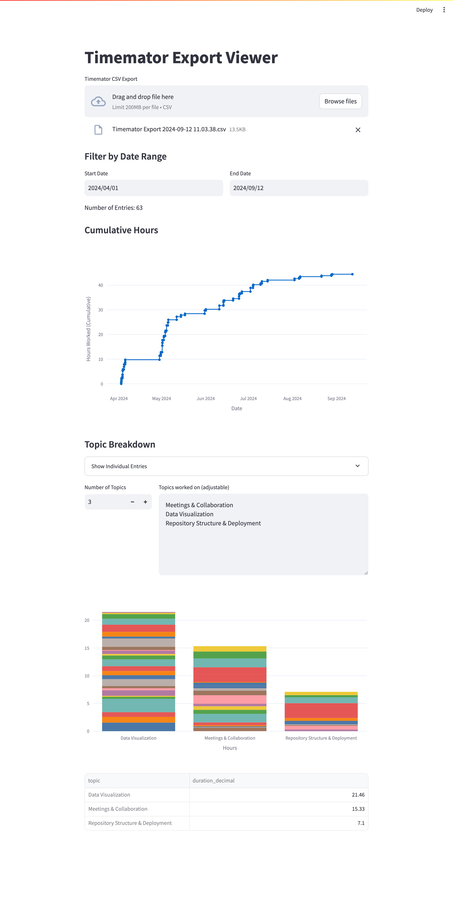

# Timemator Export Viewer

Dashboard to view Timemator exports as a cumulative graph and automatically categorize entries using Groq's LLM APIs.

## Setup

Add your Groq API key as `GROQ_API_KEY` in a `.env` file in the root directory.

Simply run `poetry install`, then `poetry run streamlit run timemator-export-viewer/dashboard.py` to start the server.
